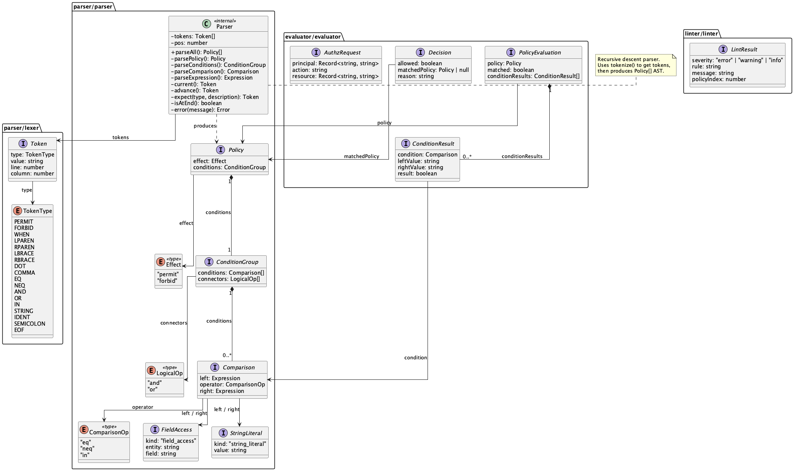
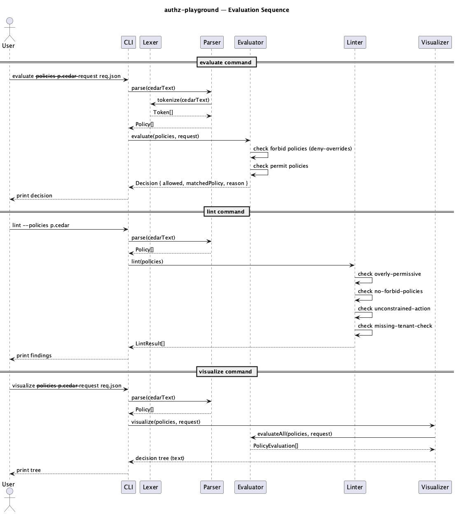

<p align="center">
<h1 align="center">authz-playground</h1>
<p align="center">Parse, evaluate, lint, and visualize Cedar authorization policies from the command line.<br/>Fast feedback loop for policy logic. No full Cedar toolchain required.</p>
</p>

<p align="center">
<a href="#quick-start">Quick Start</a> &middot;
<a href="#commands">Commands</a> &middot;
<a href="#cedar-syntax-supported-subset">Cedar Syntax</a> &middot;
<a href="#lint-rules">Lint Rules</a> &middot;
<a href="#architecture">Architecture</a> &middot;
<a href="#development">Development</a> &middot;
<a href="#license">License</a>
</p>

## Table of Contents

- [Quick Start](#quick-start)
  - [Install](#install)
  - [Write a policy](#write-a-policy)
  - [Write test requests](#write-test-requests)
  - [Evaluate](#evaluate)
- [Commands](#commands)
  - [evaluate](#evaluate-1)
  - [lint](#lint)
  - [visualize](#visualize)
- [Cedar Syntax (supported subset)](#cedar-syntax-supported-subset)
  - [Policies](#policies)
  - [Conditions](#conditions)
  - [Evaluation rules](#evaluation-rules)
  - [Comments](#comments)
  - [What's not supported](#whats-not-supported)
- [Lint Rules](#lint-rules)
- [Architecture](#architecture)
- [Development](#development)
- [License](#license)

---

## Quick Start

### Install

```bash
npm install -g authz-playground
```

### Write a policy

```cedar
// policy.cedar
permit(principal, action, resource)
  when { principal.role == "admin" && principal.tenant == resource.tenant };

forbid(principal, action, resource)
  when { resource.classification == "top_secret" && principal.clearance != "top_secret" };
```

### Write test requests

```json
[
  {
    "principal": { "role": "admin", "tenant": "acme", "clearance": "secret" },
    "action": "read",
    "resource": { "tenant": "acme", "classification": "top_secret" }
  }
]
```

### Evaluate

```bash
authz-playground evaluate --policy policy.cedar --request requests.json
```

```
[DENY] Request forbidden by matching forbid policy
  Principal: {"role":"admin","tenant":"acme","clearance":"secret"}
  Action: read
  Resource: {"tenant":"acme","classification":"top_secret"}
```

The admin has tenant access, but the `forbid` rule blocks them because their clearance doesn't match. Deny overrides permit, always.

---

## Commands

### `evaluate`

Run requests against policies and get allow/deny decisions.

```bash
authz-playground evaluate --policy policy.cedar --request requests.json
```

### `lint`

Catch common policy mistakes before they become production incidents.

```bash
authz-playground lint --policy policy.cedar
```

```
[ERROR  ] overly-permissive (policy 1): Policy 1 has no conditions and permits all requests.
[WARNING] unconstrained-action (policy 2): Policy 2 does not constrain the action, allowing all actions.
```

### `visualize`

Full evaluation trace showing which policies matched, which conditions passed or failed, and what values were compared. Use this when a request is denied and you don't know why.

```bash
authz-playground visualize --policy policy.cedar --request requests.json
```

```
Authorization Decision: DENY
├── Policy 1: permit(...) when { principal.role == "admin" && principal.tenant == resource.tenant }
│   ├── principal.role == "admin" → "admin" == "admin" → MATCH
│   ├── principal.tenant == resource.tenant → "acme" == "acme" → MATCH
│   └── Result: MATCHED (PERMIT)
└── Policy 2: forbid(...) when { resource.classification == "top_secret" && principal.clearance != "top_secret" }
    ├── resource.classification == "top_secret" → "top_secret" == "top_secret" → MATCH
    ├── principal.clearance != "top_secret" → "secret" != "top_secret" → MATCH
    └── Result: MATCHED (FORBID)
└── Final: DENIED by Policy 2
```

Both policies matched. The permit said yes, the forbid said no. Forbid wins. No guessing.

---

## Cedar Syntax (supported subset)

A practical subset of [Cedar](https://www.cedarpolicy.com/), enough to express real authorization logic without the complexity of the full spec.

### Policies

```cedar
permit(principal, action, resource)
  when { <conditions> };

forbid(principal, action, resource)
  when { <conditions> };
```

A policy with no `when` clause matches everything. That's almost always a mistake, and the linter will flag it.

### Conditions

```cedar
// field-to-literal comparison
principal.role == "admin"

// field-to-field comparison (cross-entity)
principal.tenant == resource.tenant

// action matching
action == "read"

// negation
principal.clearance != "top_secret"

// combining conditions
principal.role == "admin" && principal.tenant == resource.tenant
principal.role == "admin" || principal.role == "superadmin"
```

### Evaluation rules

1. If **any** `forbid` matches, **deny** (deny overrides, always)
2. If **any** `permit` matches, **allow**
3. If **nothing** matches, **deny** (default deny)

Same deny-overrides semantics as Cedar. Secure by default.

### Comments

```cedar
// line comments work anywhere
permit(principal, action, resource); // inline too
```

### What's not supported

Entity hierarchies, typed entity references, `unless` clauses, set operations, IP/decimal extensions, schema validation. This is a playground for reasoning about policy logic, not a production Cedar runtime.

---

## Lint Rules

| Rule | Severity | What it catches |
|------|----------|----------------|
| `overly-permissive` | error | `permit` with no conditions, permits everything |
| `no-forbid-policies` | warning | Zero `forbid` rules in the entire policy set |
| `unconstrained-action` | warning | `permit` that never checks `action`, allows read, write, delete, anything |
| `missing-tenant-check` | info | `permit` with no reference to `tenant`, risky in multi-tenant setups |

---

## Architecture

```
src/
├── parser/
│   ├── lexer.ts        # tokenizer (keywords, operators, strings, identifiers)
│   └── parser.ts       # recursive descent → AST
├── evaluator/          # policy evaluation engine (deny-overrides)
├── linter/             # static analysis on parsed policies
├── visualizer/         # text-based decision tree renderer
└── cli.ts              # three commands, zero frameworks
```

### Class Diagram



### Sequence Diagram



Design decisions:

- **Hand-written recursive descent parser.** The Cedar subset grammar is small enough that a parser generator would be overkill. Two clean passes: tokenize, then parse. Errors report line and column numbers.
- **Separated lexer and parser.** Each stage is independently testable. The token stream is a clean contract between them. Adding a new keyword means adding a token type and a parser rule, nothing else changes.
- **Zero runtime dependencies.** The whole tool is TypeScript and `node`. No CLI framework, no YAML parser, no external anything. Cedar files are parsed with the custom parser. Requests are JSON.
- **Deny-overrides by design.** Not configurable. If you need permit-overrides semantics, you're probably building something that shouldn't be a playground tool.

See [docs/adr/](docs/adr/) for the full decision records.

---

## Development

```bash
git clone https://github.com/ksibati/authz-playground.git
cd authz-playground
npm install
npm test        # 59 tests across 5 suites
npm run build
```

Tests are spec-driven and table-driven throughout. The evaluator alone has 16 test cases covering every combination of permit/forbid/default-deny with various condition types.

Open an issue before starting work on anything significant. PRs should include tests written before the implementation.

---

## License

MIT
