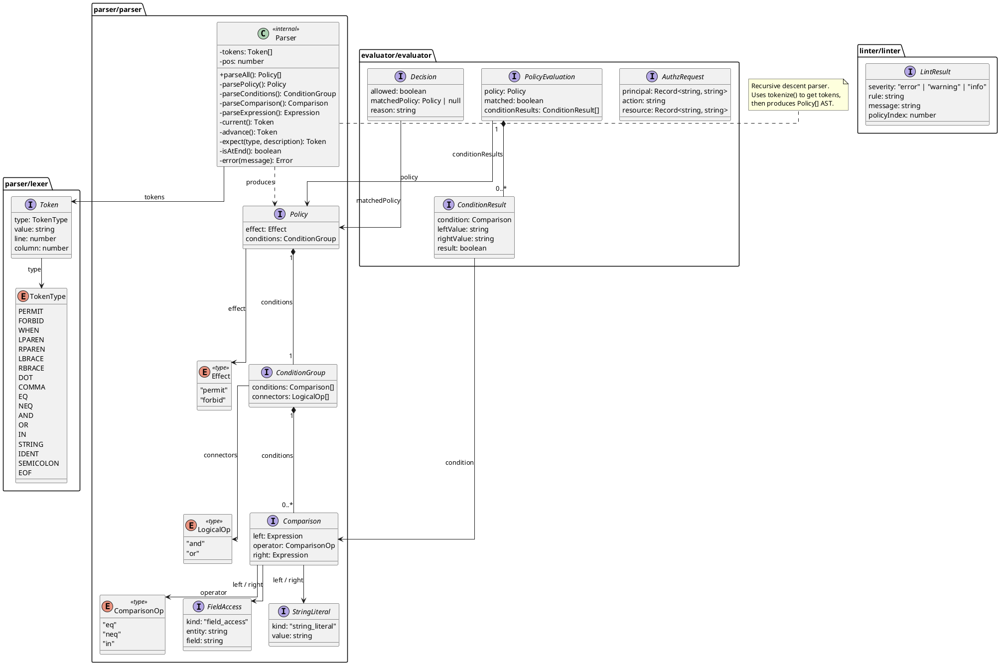

# authz-playground

A CLI tool for parsing, evaluating, linting, and visualizing authorization policies written in a subset of [Cedar](https://www.cedarpolicy.com/) — AWS's open-source policy language.

Built this because I kept running into the same problem: authorization logic buried in application code, scattered across middleware and service layers, impossible to reason about. Cedar's approach — declarative policies, evaluated centrally — is the right model. But spinning up the full Cedar toolchain just to prototype a policy or validate your rules against test requests is friction you don't need.

`authz-playground` gives you a fast feedback loop: write policies, throw requests at them, see exactly why something was allowed or denied.

## Install

```bash
npm install -g authz-playground
```

## Quick start

Write a policy:

```cedar
// policy.cedar
permit(principal, action, resource)
  when { principal.role == "admin" && principal.tenant == resource.tenant };

forbid(principal, action, resource)
  when { resource.classification == "top_secret" && principal.clearance != "top_secret" };
```

Write some test requests:

```json
[
  {
    "principal": { "role": "admin", "tenant": "acme", "clearance": "secret" },
    "action": "read",
    "resource": { "tenant": "acme", "classification": "top_secret" }
  }
]
```

Evaluate:

```bash
authz-playground evaluate --policy policy.cedar --request requests.json
```

```
[DENY] Request forbidden by matching forbid policy
  Principal: {"role":"admin","tenant":"acme","clearance":"secret"}
  Action: read
  Resource: {"tenant":"acme","classification":"top_secret"}
```

The admin has tenant access, but the `forbid` rule blocks them because their clearance doesn't match. Deny overrides permit — always.

## Commands

### `evaluate`

Run requests against policies and get allow/deny decisions.

```bash
authz-playground evaluate --policy policy.cedar --request requests.json
```

### `lint`

Catch common policy mistakes before they become production incidents.

```bash
authz-playground lint --policy policy.cedar
```

```
[ERROR  ] overly-permissive (policy 1): Policy 1 has no conditions and permits all requests.
[WARNING] unconstrained-action (policy 2): Policy 2 does not constrain the action, allowing all actions.
```

### `visualize`

See the full evaluation trace — which policies matched, which conditions passed or failed, and what values were compared. This is the command you want when a request is denied and you don't know why.

```bash
authz-playground visualize --policy policy.cedar --request requests.json
```

```
Authorization Decision: DENY
├── Policy 1: permit(...) when { principal.role == "admin" && principal.tenant == resource.tenant }
│   ├── principal.role == "admin" → "admin" == "admin" → MATCH
│   ├── principal.tenant == resource.tenant → "acme" == "acme" → MATCH
│   └── Result: MATCHED (PERMIT)
└── Policy 2: forbid(...) when { resource.classification == "top_secret" && principal.clearance != "top_secret" }
    ├── resource.classification == "top_secret" → "top_secret" == "top_secret" → MATCH
    ├── principal.clearance != "top_secret" → "secret" != "top_secret" → MATCH
    └── Result: MATCHED (FORBID)
└── Final: DENIED by Policy 2
```

Both policies matched. The permit said yes, the forbid said no. Forbid wins. No guessing.

## Cedar syntax (supported subset)

This tool implements a practical subset of Cedar — enough to express real authorization logic without the complexity of the full spec.

### Policies

```cedar
permit(principal, action, resource)
  when { <conditions> };

forbid(principal, action, resource)
  when { <conditions> };
```

A policy with no `when` clause matches everything. That's almost always a mistake — the linter will flag it.

### Conditions

```cedar
// field-to-literal comparison
principal.role == "admin"

// field-to-field comparison (cross-entity)
principal.tenant == resource.tenant

// action matching
action == "read"

// negation
principal.clearance != "top_secret"

// combining conditions
principal.role == "admin" && principal.tenant == resource.tenant
principal.role == "admin" || principal.role == "superadmin"
```

### Evaluation rules

1. If **any** `forbid` matches → **deny** (deny overrides, always)
2. If **any** `permit` matches → **allow**
3. If **nothing** matches → **deny** (default deny)

This is the same deny-overrides semantics Cedar uses. Secure by default.

### Comments

```cedar
// line comments work anywhere
permit(principal, action, resource); // inline too
```

### What's not supported

Entity hierarchies, typed entity references, `unless` clauses, set operations, IP/decimal extensions, schema validation. This is a playground for reasoning about policy logic, not a production Cedar runtime.

## Lint rules

| Rule | Severity | What it catches |
|------|----------|----------------|
| `overly-permissive` | error | `permit` with no conditions — permits everything |
| `no-forbid-policies` | warning | Zero `forbid` rules in the entire policy set |
| `unconstrained-action` | warning | `permit` that never checks `action` — allows read, write, delete, anything |
| `missing-tenant-check` | info | `permit` with no reference to `tenant` — risky in multi-tenant setups |

## Architecture

```
src/
├── parser/
│   ├── lexer.ts        # tokenizer (keywords, operators, strings, identifiers)
│   └── parser.ts       # recursive descent → AST
├── evaluator/          # policy evaluation engine (deny-overrides)
├── linter/             # static analysis on parsed policies
├── visualizer/         # text-based decision tree renderer
└── cli.ts              # three commands, zero frameworks
```

### Component Diagram

```plantuml
@startuml component-diagram
skinparam componentStyle rectangle
skinparam linetype ortho

package "authz-playground" {

  component "index.ts" as index
  component "cli.ts" as cli

  package "parser" {
    component "lexer.ts" as lexer
    component "parser.ts" as parser
  }

  package "evaluator" {
    component "evaluator.ts" as evaluator
  }

  package "linter" {
    component "linter.ts" as linter
  }

  package "visualizer" {
    component "visualizer.ts" as visualizer
  }
}

actor "User" as user

' Entry point
index --> cli : runCli(args)

' CLI dispatches to commands
cli --> parser : parse(input)
cli --> evaluator : evaluate(policies, request)
cli --> linter : lint(policies)
cli --> visualizer : visualize(policies, request)

' Internal module dependencies
parser --> lexer : tokenize(input)
evaluator ..> parser : <<imports>>\nPolicy, Expression,\nComparison, ConditionGroup
linter ..> parser : <<imports>>\nPolicy
visualizer --> evaluator : evaluate()\nevaluateAll()
visualizer ..> parser : <<imports>>\nPolicy, Expression, Comparison

' External interaction
user --> index : CLI invocation

' Data flow notes
note right of lexer
  Input: Cedar policy text
  Output: Token[]
end note

note right of parser
  Input: Cedar policy text
  Output: Policy[]
  (calls lexer internally)
end note

note right of evaluator
  Input: Policy[], AuthzRequest
  Output: Decision / PolicyEvaluation[]
  Implements deny-overrides logic
end note

note right of linter
  Input: Policy[]
  Output: LintResult[]
  Rules: overly-permissive,
  no-forbid-policies,
  unconstrained-action,
  missing-tenant-check
end note

note right of visualizer
  Input: Policy[], AuthzRequest
  Output: text-based decision tree
  Uses evaluator for evaluation data
end note

@enduml
```

### Class Diagram



Intentional choices:

- **Hand-written recursive descent parser.** The Cedar subset grammar is small enough that a parser generator would be overkill. Two clean passes: tokenize, then parse. Errors report line and column numbers.
- **Separated lexer and parser.** Each stage is independently testable. The token stream is a clean contract between them. Adding a new keyword means adding a token type and a parser rule — nothing else changes.
- **Zero runtime dependencies.** The whole tool is TypeScript and `node`. No CLI framework, no YAML parser, no external anything. Cedar files are parsed with the custom parser, requests are JSON.
- **Deny-overrides by design.** Not configurable. If you need permit-overrides semantics you're probably building something that shouldn't be a playground tool.

See [docs/adr/](docs/adr/) for the full decision records.

## Development

```bash
git clone https://github.com/ksibati/authz-playground.git
cd authz-playground
npm install
npm test        # 59 tests across 5 suites
npm run build
```

Tests are spec-driven and table-driven throughout. The evaluator alone has 16 test cases covering every combination of permit/forbid/default-deny with various condition types.

## Contributing

Open an issue before starting work on anything significant. PRs should include tests written before the implementation — that's how this project was built and that's how it should stay.

## License

MIT
